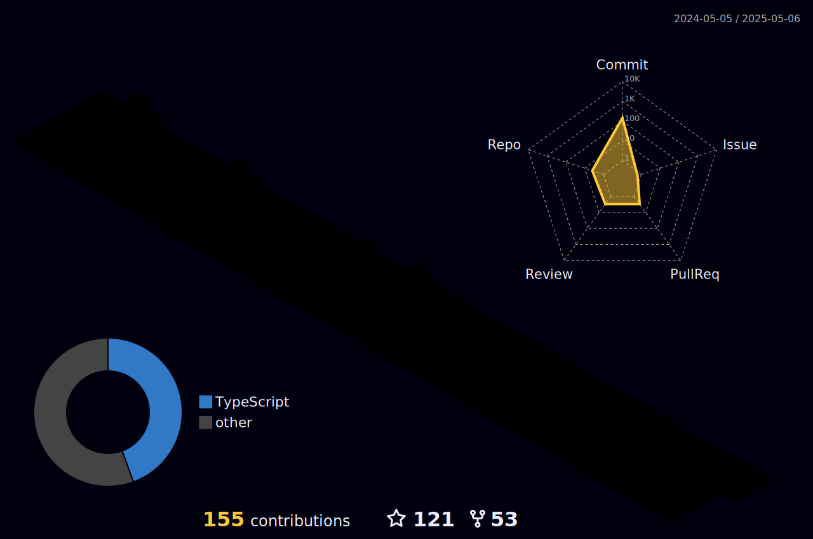

  
  

  
 |  |  |  
 | ----------- | ----------- |

 
  

   

  

 
##
   

     
  

  
 

### Hi there 👋, I'm Raphael Ferreira

- 🔭 I’m currently working as a Full Stack Developer
- 😄 Pronouns: He/His

  
  
  
  
  

 
  
  
  
  
  
  
  
  
  
  
  
  
  
  
  

  
  ##
 

 
  
  
   
  

 
  
  

  
